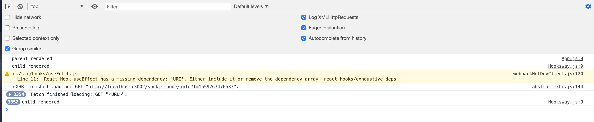

# Fetching and setting state with React...

[](https://greenkeeper.io/)
[](https://opensource.org/licenses/MIT)

This is an easy, basic and raw (no styles attached) example of **HOW to** `fetch` data from x-endpoint and set it as `local state`.

Feel free to replace the `API` with yours or an external one. In any case (also for `localhost` with other `port`) remember to `enable CORS`

## Installation
```
yarn install
```

## Running the dev server
```
yarn start
```

## Description

### Option 1: `<RegularWay />`
### Option 2: `<HooksWay />`
### Option 3: `<CustomHookWay />`


## Using *Async/Await*

Alternatively, you can use *Async/Await*

Snippet for `react-state-fetch/src/containers/RegularWay.js`

```javascript
  componentDidMount() {
    this.fetchUsers()
  }

  /* Or
  async fetchUsers() {}
*/
  fetchUsers = async () => {
    try {
      const response = await fetch(API + limitQuery + limitUserResults)
      const parsedResponse = await response.json()
      this.setState({ users: parsedResponse })
    }
    catch (error) {
      console.log('RegularWay', error)
    }
  }
```

---

## Avoiding infinite loops

Even when this is *outside* the scope of the project's documentation, remember that you should be particularly careful at the time of using `hooks` like `useEffect()`.

The *difference* between this...

```javascript
// Runs with every render
useEffect(() => {
})
```
... and this ...

```javascript
// Runs once
useEffect(() => {
}, [])
```

... is an **infinite loop**.

